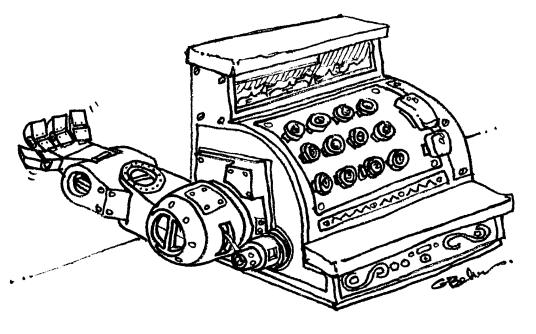

# goutmp
Go bindings to maintain the traditional UNIX utmp/utmpx and lastlog, used for tracking remote terminal sessions.

## I no longer host (new) projects on Github, preferring self-hosted solutions and to avoid Github Copilot doing unauthorized scans of project code. See https://gogs.blitter.com/RLabs/goutmp to learn more about this project.
---
